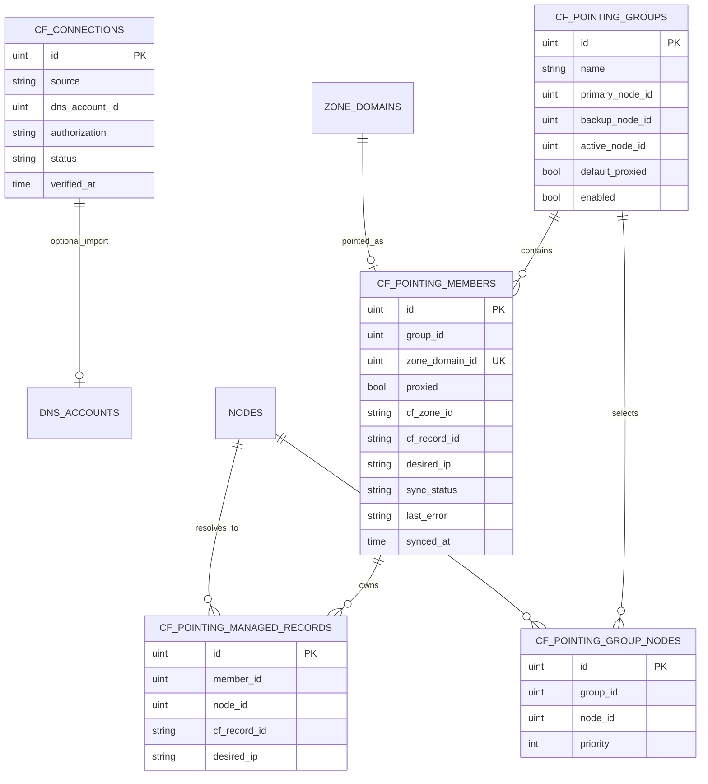

# Cloudflare DNS 指向设计

## 目标

通过 Cloudflare API 将 OpenFlare 中的 **ZoneDomain（明确 FQDN）** 快速指向边缘节点 IP，替代在 CF 控制台手工改 A 记录。用户以 **指向分组** 组织域名：每组配置多个带优先级的节点和默认橙云策略；成员可单独覆盖橙云。系统以库表为期望状态，幂等同步远端 DNS。

本模块是 **可选对接能力**，不把 Zone 本身变成权威 DNS 控制面。Zone 仍只负责根域边界、域名、证书与反代关联；DNS A 记录的创建/更新/删除由本模块驱动 Cloudflare。

## 范围与分期

### 一期（本设计落地范围）

* 侧边栏 **Cloudflare** 入口与 Token 就绪门禁
* 连接配置：从现有 DNS 账号导入 **或** 模块内独立录入（混合来源），加密存储
* 指向分组 CRUD：多个节点及优先级、分组默认橙云
* 成员管理：以 `zone_domain_id` 为粒度加入/移出；成员级橙云
* 同步：将每个成员写成 Cloudflare 上一条或多条同名 A 记录，指向最低可用优先级的全部在线节点
* 触发：手动同步、加入成员、改节点/橙云、节点 IP 变更入队
* 异步任务批量同步；成员同步状态与可读错误
* 精确记录本模块创建的远端记录，只更新或删除受管记录

### 二期

* 节点状态防抖、故障通知推送
* 可配置自动回切策略与切换冷却时间

### 明确不做（更远或永久）

* 多 Cloudflare 账号并行（全局一份连接配置）
* AAAA / CNAME 到节点主机名
* 管理 MX/TXT/Page Rules 等非本模块 A 记录
* 非 Cloudflare DNS 厂商
* 将 DNS 记录管理并入 Zone 核心模型

## 与现有能力的关系

| 现有能力 | 关系 |
| --- | --- |
| `of_zones` / `of_zone_domains` | 提供可指向的 FQDN 清单；本模块只引用 `zone_domain_id` |
| `of_nodes.ip` | A 记录 `content` 来源；建议限制 edge 节点且 IP 为合法 IPv4 |
| `of_dns_accounts` + `sealSensitive` | ACME DNS-01 已支持 Cloudflare Token；本模块可 **导入** 同一账号，也可独立存 Token |
| lego Cloudflare provider | **仅** TXT/DNS-01；本模块自建 CF HTTP 客户端做 Zone/DNS Record API |

## 核心模型

### `of_cf_connections`（全局一份有效连接）

| 字段 | 说明 |
| --- | --- |
| `source` | `dns_account` \| `standalone` |
| `dns_account_id` | `source=dns_account` 时关联 `of_dns_accounts`（type=cloudflare） |
| `authorization` | `source=standalone` 时加密存储，载荷形状 `{"api_token":"..."}`，与 DNS 账号一致；API **永不回传** |
| `status` / `verified_at` | 连通校验结果与时间 |

**Token 解析：** `dns_account` → 解密关联账号；`standalone` → 解密本行。关联账号删除或校验失败 → 模块未就绪，禁止同步。

**建议权限：** Cloudflare API Token 含 `Zone:Read`、`DNS:Edit`。

### `of_cf_pointing_groups`

| 字段 | 说明 |
| --- | --- |
| `name` | 展示名 |
| `primary_node_id` | 兼容字段，投影为排序后的第一个节点 |
| `backup_node_id` | 兼容字段，投影为排序后的第二个节点（可空） |
| `active_node_id` | 兼容字段，记录当前最低可用优先级中的首个节点 |
| `default_proxied` | 分组默认橙云；**仅影响新加入成员** |
| `enabled` | 是否参与同步 |

### `of_cf_pointing_group_nodes`

| 字段 | 说明 |
| --- | --- |
| `group_id` | 所属分组 |
| `node_id` | 参与该分组解析的边缘节点 |
| `priority` | 非负整数，数值越小越优先；同一优先级共同发布 |

同一分组内节点不可重复。同步时扫描全部在线且具有合法 IPv4 的节点，只选择其中最低优先级的一层；因此支持一主多备、二主多备及更多同层节点。

### `of_cf_pointing_members`

| 字段 | 说明 |
| --- | --- |
| `group_id` | 所属分组 |
| `zone_domain_id` | 全局唯一：一域名最多在一个分组 |
| `proxied` | 成员橙云（运行时唯一依据） |
| `cf_zone_id` | Cloudflare Zone 缓存 |
| `cf_record_id` / `desired_ip` | 单记录时期的兼容字段，投影当前首条受管记录 |
| `sync_status` / `last_error` / `synced_at` | 同步状态 |

`sync_status`：`pending` \| `syncing` \| `ok` \| `error`。

无物理外键；`zone_domain_id` 唯一索引；`group_id` 等查询索引。

### `of_cf_pointing_managed_records`

| 字段 | 说明 |
| --- | --- |
| `member_id` | 所属成员 |
| `node_id` | 记录所对应的节点 |
| `cf_record_id` | Cloudflare DNS Record ID |
| `desired_ip` | 最近同步的 IPv4 |

该表是远端记录所有权依据。同步只更新或删除表中登记的记录，不接管或删除 Cloudflare 上其他来源创建的同名 A 记录。

## 橙云优先级

1. **成员 `proxied`**：同步时写入 CF 的唯一依据。
2. **分组 `default_proxied`**：成员 **加入时** 拷贝到 `proxied`。
3. 之后修改分组默认值 **不回写** 已有成员。

## 同步语义

### 期望状态

OpenFlare 库表为 Source of Truth。每个成员期望：

| 项 | 值 |
| --- | --- |
| type | `A` |
| name | ZoneDomain 的 FQDN |
| content | 分组最低可用优先级中各在线节点的 IPv4；每个节点一条同名 A |
| proxied | 成员 `proxied` |
| ttl | 橙云开启时由 CF 强制 Auto；关闭时使用统一默认（如 300） |

一期不写 AAAA。离线或无合法 IPv4 的节点不参与当前可用层选择；所有节点均不可用时该成员同步失败。

### 触发

| 触发 | 行为 |
| --- | --- |
| 手动同步（全部 / 组 / 成员） | reconcile |
| 成员加入 | 初始化 `proxied` 后入队同步 |
| 成员移出 / 删组 | 默认删除本模块管理的远端 A（可配置保留） |
| 改分组节点 / priority / 成员 proxied | 对应范围重新同步 |
| 节点 IP 或在线状态变更（心跳或手动） | 包含该节点的分组成员入队 |
| Token 未就绪 | 拒绝同步 |

一期不做定时全量对账。

### Reconcile（单成员，幂等）

1. 用 FQDN 注册根域解析 CF Zone，缓存 `cf_zone_id`。
2. 从全部分组节点中找出在线、IPv4 合法且 priority 最小的一层，生成期望记录集合。
3. 按 `of_cf_pointing_managed_records` 对已有受管记录逐条 Update；只有 Cloudflare 明确返回 HTTP 404 时才视为记录不存在并重新 Create。
4. 为新增期望节点 Create A 记录，并登记 Record ID；删除已登记但不再属于期望集合的远端记录及本地关系。
5. 写回兼容字段、`active_node_id`、`sync_status`、`synced_at` / `last_error`。
6. 403、429、5xx 或网络错误直接保留错误状态，不得当作记录不存在而重复创建。

**所有权：** 只管理 `of_cf_pointing_managed_records` 登记的记录；不接管、不覆盖、不删除其他来源创建的同名 A，也不改其他类型记录。用户在 CF 控制台删除受管记录后，下次同步会在确认 404 后重新创建。

### 执行载体

* 单条：可在请求路径同步。
* 整组 / 按节点批量：Asynq 任务（`cloudflare:sync_member` / `sync_group` / `sync_by_node`），`bootstrap` 注册。
* 同成员互斥，防止并发双写。
* 节点 IP 变更路径 **best-effort** 投递任务，不阻断心跳。

## API（管理端）

前缀：`/api/v1/d/cloudflare`，Session 管理员鉴权。包：`internal/apps/openflare/cloudflare/`；路由：`internal/router/v1/openflare/register_cloudflare.go`。

| 资源 | 方法与路径 |
| --- | --- |
| 连接 | `GET/PUT /connection`，`POST /connection/verify`，`POST /connection/clear` |
| 总览 | `GET /overview` |
| 分组 | `GET/POST /groups`，`GET /groups/:id`，`POST /groups/:id/update|delete|sync` |
| 成员 | `GET/POST /groups/:id/members`，`POST .../members/:memberId/update|remove|sync` |
| 可选域名 | `GET /domains/available` |

* 成功 `response.OK`；失败 `response.Abort*`；**永不**在 JSON 中返回 Token。
* Handler 与 `logics.go` 分离；CF 客户端以接口抽象便于替换。

## 前端

* 导航：`frontend/lib/navigation/openflare-nav.ts` 增加 **Cloudflare** → `/cloudflare`（建议放在网站管理组、DNS 账号附近）。
* 路由：
  * `/cloudflare`：总览；未就绪则引导配置
  * `/cloudflare/settings`：混合 Token 配置与测试连接
  * `/cloudflare/groups`、`/cloudflare/groups/[id]`：列表与详情（成员、橙云、同步）
* 服务：`frontend/lib/services/openflare/` 下独立 service，继承 `BaseService`。
* 页面遵循现有标题栏与组件拆分规范；危险操作二次确认。
* 必须可见的文案：同 priority 节点共同发布，较大 priority 仅在前层无可用节点时启用；同步只覆盖本模块管理的 A；移出默认删除受管远端记录。

## 错误与安全

* 用户可见文案为模块内常量；内部错误打 `pkg/logger`。
* 典型：未配置 Token、Token 无效、无可用节点、CF 无 Zone、限流、受管记录查询或更新失败。
* Token 仅服务端解密使用；响应与日志禁止明文 Token。

## 数据迁移

* goose 双方言（PG/SQLite）新建连接、分组、成员、分组节点与受管记录表；默认值与 Go 零值一致。
* DDL 与兼容数据回填分离；升级时将既有 primary/backup 转成分组节点，并将既有 `cf_record_id` 登记为受管记录。
* 回填迁移的 Down 不删除数据，避免误删升级后由用户新增的节点或受管记录。

## 关键决策摘要

| 决策 | 结论 |
| --- | --- |
| 模块形态 | 独立 Cloudflare 指向模块，非 Zone 内嵌字段 |
| Token | 混合：DNS 账号导入或独立加密 |
| 域名粒度 | ZoneDomain（FQDN） |
| 记录形态 | 最低可用 priority 层的一个或多个同名 A |
| 故障切换 | 依据在线状态自动选择下一可用 priority；防抖、冷却与通知后续完善 |
| 橙云 | 成员级生效；分组默认仅初始化 |
| SoT | 库表期望状态驱动 CF |
| 远端所有权 | 仅操作本地 managed record 表登记的 Record ID |
